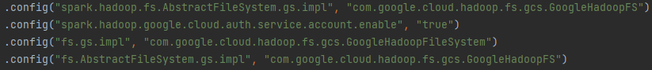

# M06_SparkBasics_JVM_GCP
1) Create your own project on GCP (currently Google offers trial accounts up to 300$).
2) Install Google Cloud CLI (gcloud & gsutil), Kubernetes controls (kubectl) and spark on your host machine.
3) Use `gcloud auth login && gcloud auth application-default login && gcloud config set project [PROJECT]` to initialize access to your project.
4) Run `terraform init && terraform apply`. Provide your project ID and already **existing** bucket for Terraform state. Wait until GCS bucket and cluster are created.
5) Use `gsutil iam ch serviceAccount:[PROVIDED_SERVICE_ACCOUNT_BUCKET_EMAIL]:objectAdmin gs://[CREATED_BUCKET]` to give to the provided service account RW access to the bucket in your project.
6) Put key .json file from the provided service account to the service_account_key folder. Optionally you can provide needed dependency through Dockerfile or build a fat JAR.
7) Set GOOGLE_APPLICATION_CREDENTIALS on your host machine to point to the same key .json file for the provided service account.
8) Run `gcloud container clusters get-credentials [CLUSTER_NAME] --zone [CLUSTER_ZONE] --project [PROJECT]` to configure kubectl to work with your k8s cluster
9) Use `kubectl cluster-info` to get k8s master's external IP or use kubernetes_cluster_endpoint from terraform's output.
10) Use `spark-submit --master k8s://https://[k8s_master_ip] --class [ENTRYPOINT] --deploy-mode cluster --name [APPLICATION_NAME] --conf spark.kubernetes.file.upload.path=gs://[GCS_PATH_FOR_STAGING] --conf spark.kubernetes.container.image=[DOCKER_IMAGE] [JAR_FILE]` to launch the job.  
    NOTE: Sometimes you might get an access error from k8s cluster if you wait for too long. In that case just use kubectl get pods to refresh your kubectl access token before using spark-submit again.
11) After the task is done don't forget to `terraform destroy` your GCP resources.  
  
NOTE: You might have to use such configuration in your spark code for it to run on GCP:  
