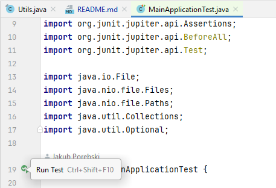

# Spark Basics - Homework application 
_Jakub Porebski notes_

### How to run tests
This is the quickest way to run and test the application. Just open `MainApplicationTest.java` file and run it as a unit test.



By default, this test will be storing temporary files in a `/tmp/m06sparkbasics` directory. You can change that by providing an `TESTING_DIRECTORY` environment variable.
### How to run locally 

_note: Instructions for Windows 10_

#### Preparing data
* There is a zip file (split into a few files) on the learning platform ready to download. 
* Unpack it to a directory `c:/temp`, so that files with data will be in `c:/temp/m06sparkbasics`.
* There should be folders: `C:/temp/m06sparkbasics/hotels` and `C:/temp/m06sparkbasics/weather`.
* This - `C:/temp/m06sparkbasics` - folder will be our working folder, where the app will get the input data and store the results. 
  Path to it will be passed as ENV variable (`HOMEWORK_DATA_DIR`) to a docker container.
* Directory with input files should look like this:
.png)

#### Running 
* Start a command line app and go into the project directory using `cd` command.
* Build a maven package: `mvn package -DskipTests=true -DisTestSkip=true`. We're skipping tests, because there is only single test for `OpenCageLatLonCorrector` class.
  .png)
  If you want to run the test, feel free to do it - you need to add `OPENCAGE_API_KEY` parameter - however it is not necessary to do so.
* Next, prepare a docker image: `docker build -t jp/sparkbasics .`
  .png)
* Lastly, run a docker container. Following command won't use OpenCage API.
```
docker run --rm -p 4040:4040 -e HOMEWORK_DATA_DIR=/homework -v "C:/temp/m06sparkbasics:/homework" -e SPARK_EXECUTOR_MEMORY=16G --name sb jp/sparkbasics spark-submit --executor-memory 12G --driver-memory 4G --class jporebski.data.sparkbasics.MainApplication /opt/sparkbasics-1.0.0.jar
``` 
If you want to get preview what Spark is actually doing at the moment, go to `http://localhost:4040`. You should see something like this:
.png)
And in console it should look like this:
.png)
* Following command will use OpenCage API. Replace `PROVIDE_YOURS` below with your OpenCage API Key.
```
docker run --rm -p 4040:4040 -e HOMEWORK_DATA_DIR=/homework -e LATLON_CORRECTOR=OpenCageLatLonCorrector -e OPENCAGE_API_KEY=PROVIDE_YOURS -v "C:/temp/m06sparkbasics:/homework" -e SPARK_EXECUTOR_MEMORY=16G --name sb jp/sparkbasics spark-submit --executor-memory 12G --driver-memory 4G --class jporebski.data.sparkbasics.MainApplication /opt/sparkbasics-1.0.0.jar
```
* After computing will be done, console window should look like this:
  .png)
* Results are in the folder `C:/temp/m06sparkbasics/joined`. Let's go there and see what it's inside:
  .png)
* As you can see, everything run correctly.


### How to run in the cloud
_There should be a docker image created in on of the previous steps._

TODO

* Tag and push docker image.
* Deploy infrastructure with terraform.
```
terraform init
terraform plan -out terraform.plan
terraform apply terraform.plan
```
* Launch Spark app in cluster mode on Kubernetes Cluster
```
spark-submit \
    --master k8s://https://<k8s-apiserver-host>:<k8s-apiserver-port> \
    --deploy-mode cluster \
    --name sparkbasics \
    --conf spark.kubernetes.container.image=<spark-image> \
    ...
```

* After everything is done, clean up by running `terraform destroy`.
* 